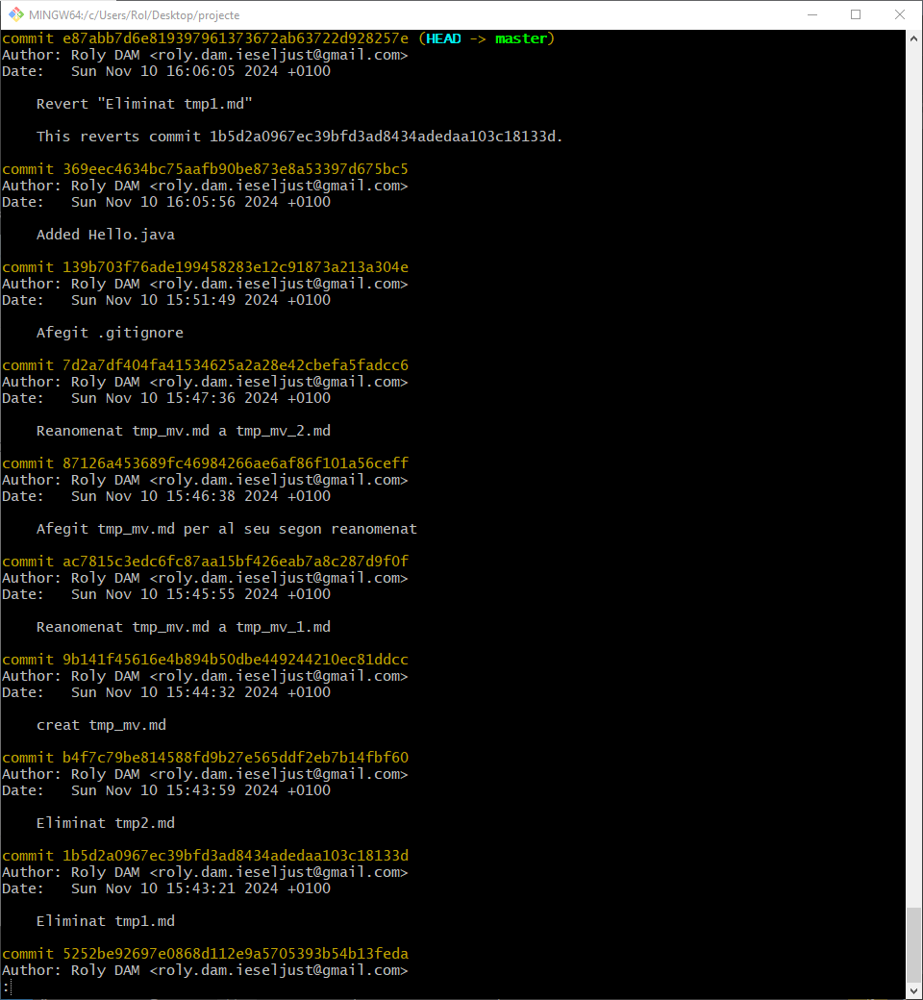
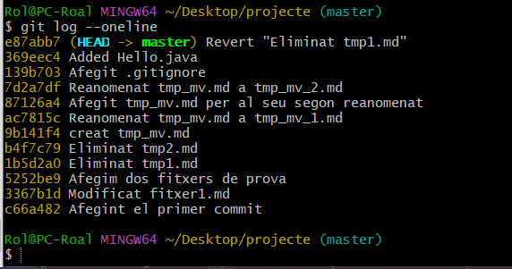

# El sistema de control de versiones distribuido git

## Ejercicio 1
Mentre vas realitzant els diferents passos, ves fent una xicoteta guía en markdown del que consideres més important, relacionant-ho amb l'apartat de teoría.

Anota en ella els diferents canvis que vas fent sobre el teu directori de treball.

### **Anotaciones de comandos:**

1. Instalación/comprobación de versión/ayuda  

    `sudo apt update`  
    `sudo apt install git`  
    `git --version`  
    `git help ordre`

2. Inicializar repositorio *donde estas:

    `git init`

3. Configurar usuario:

    `git config --global user.name "Tu Nombre"`  
    `git config --global user.email "email@ejemplo.com"`

4. Estado:

    `git status`

5. Añadir archivos:

    Preparar archivos para el commit:
    `git add <file>`

6. Eliminar archivo del repositorio y del sistema de archivos:

    `git rm <file>`
    
    Para quitar un archivo del control de Git sin borrarlo fisicamente:  
    `git rm --cached <file>`

7. Deshacer cambios:

    `git restore archivo.txt`
    
    Elimina el archivo “file” del área de preparación (staging area), pero no afecta los cambios realizados en el archivo en tu espacio de trabajo. Es útil para deshacer un `git add` antes de hacer un commit.  
    `git restore --staged <file>`

8. Guardar cambios:

    `git commit`

    Registra cambios en el historial:  
    `git commit -m “Comentario”`

9. Omitir `git add`:
    Esto incluye automáticamente todos los archivos rastreados que hayan sido modificados (pero no nuevos).  
    `git commit -a -m "Mensaje del commit"`  

    Esto guarda los cambios directamente. Nota: Los archivos nuevos aún necesitan `git add`.  

10. Consultar historial:

    `git log`

    De forma más simplificada:  
    `git log --oneline`

11. Deshace un commit específico:

    Deshace un commit específico creando un nuevo commit que invierte sus cambios, sin alterar el historial. Es ideal para mantener el historial limpio y sin eliminar commits previos.  
    `git revert <id>`

12. Eliminar archivos:

    Elimina archivos no rastreados (no versionados por Git) de tu espacio de trabajo, como archivos temporales o generados.
    `git clean`

    `-f` **(force)** obliga la limpieza, ya que Git no ejecuta este comando por defecto sin confirmación para evitar borrados accidentales.  
    `git clean -f`

    `-d`  elimina carpetas no rastreadas junto con los archivos no rastreados.  
    `git clean -f -d`

13. Listar las ramas existentes:

    Te muestra todas las ramas disponibles en el repositorio.
    `git branch`

14. Crear una nueva rama:

    Crea una nueva rama con el nombre que elijas, pero no te cambia automáticamente a ella.
    `git branch <rama>`

15. Cambiar a otra rama:

    Cambia a la rama que indiques para trabajar en ella.
    `git checkout <rama>`

16. Eliminar una rama:

    Borra una rama que ya no necesites, pero solo si está completamente fusionada.
    `git branch -d <rama>`

17. Restablecer el repositorio a un commit anterior:

    Restablece todos los archivos del repositorio al estado exacto de un commit anterior. Advertencia: Los cambios posteriores no guardados pueden perderse.
    `git reset --hard <id_commit>`

El archivo `.gitignore` le dice a Git qué archivos o carpetas no debe incluir en el control de versiones. Es útil para evitar subir datos sensibles, archivos temporales o generados automáticamente, como logs o configuraciones locales.

Este archivo debe hacerse un add y un commit.

Este archivo contiene varias líneas que seguirán las siguientes reglas:

* Cada línea contendrá un patrón.
* Se admiten líneas en blanco como separador para mejorar la legibilidad.
* Los comentarios comienzan con `#`.
* El prefijo `!` niega el patrón (hará que sí incluyan a git los archivos indicados).
* Podemos utilizar el comodín `*` para indicar cualquier cadena de caracteres.
* Podemos utilizar la interrogación (`?`) para reemplazar a un carácter cualquiera.
* Podemos utilizar expresiones regulares tipo `[0-9]`, `[ao]`.

Ejemplo de fichero `.gitignore`.

```
# Ignorar els fitxers amb nom temporal_6.txt i temporal_7.zip
temporal_6.txt
temporal_7.zip

# Ignorar els fitxers amb extensió zip, gz, changes o deb:
*.zip
*.gz
*.changes
*.deb

# Ignorar els fitxers amb extensió .log de la carpeta log, així
# com les extensions .log0, .log1, log2...
log/*.log
log/*.log[0-9]

# Ignorar tots els fitxers del directori imatges
imatges/*

# Ignorar tots els fitxers que acaben en 'a' o 'o' de la 
# carpeta compilats
compilats/*[ao]
```

------

## **Ejercicio 2**
Una vegada hages finalitzat, còpia com a codi el resultat de l'ordre:  
`git log`

I adjunta al final del document també una captura de pantalla del resultat de:  
`git log --oneline`





[Recursos]

-----

[https://joamuran.net/curs24_25/edd/ud3_scv/5.svc_git/](https://joamuran.net/curs24_25/edd/ud3_scv/5.svc_git/)
[https://joamuran.net/curs24_25/edd/ud3_scv/6.branques/](https://joamuran.net/curs24_25/edd/ud3_scv/6.branques/)
