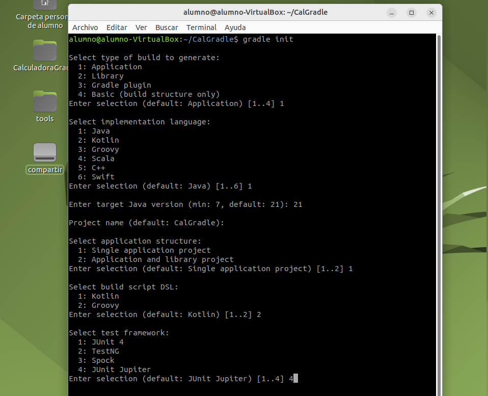
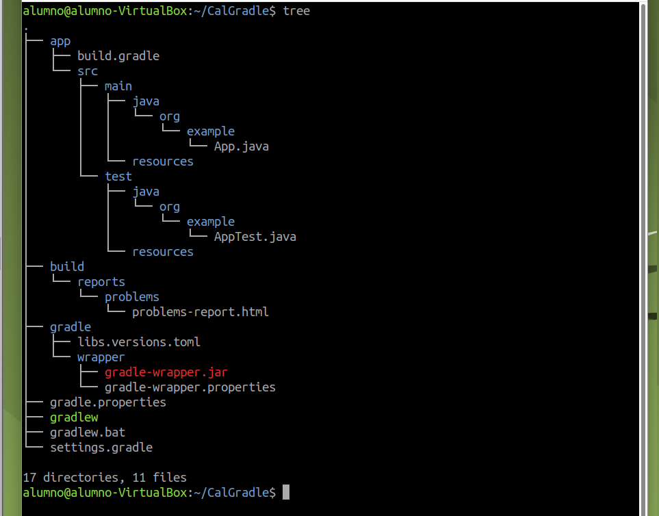
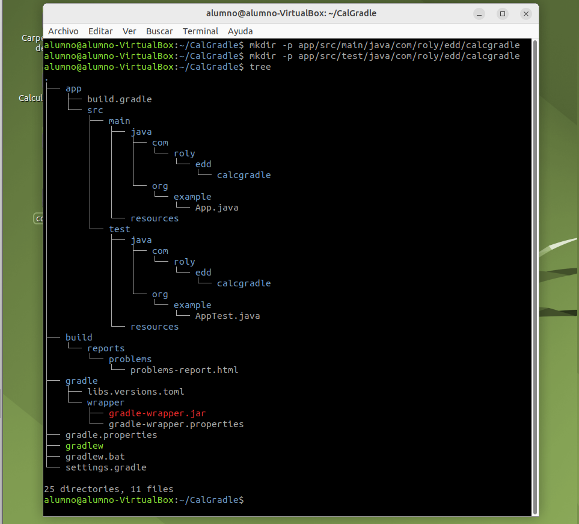
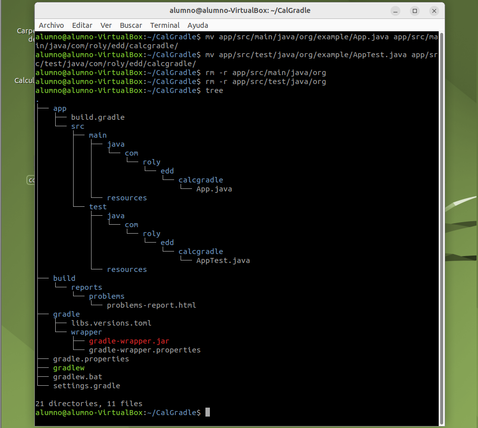
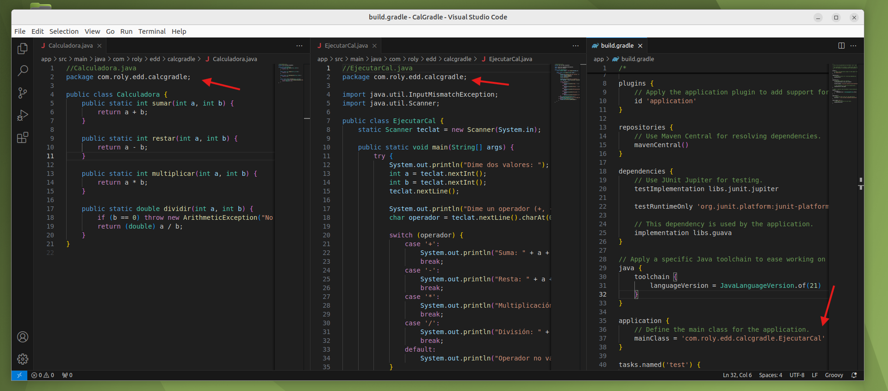
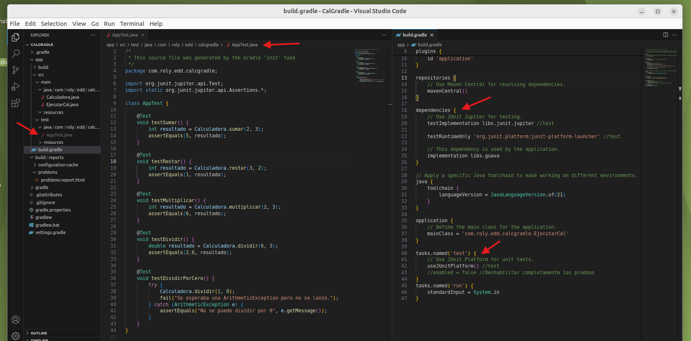
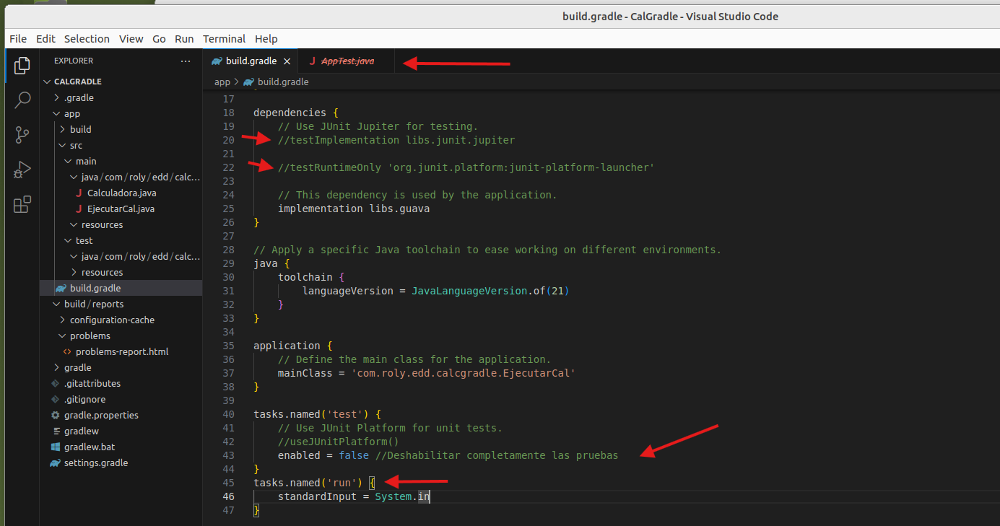
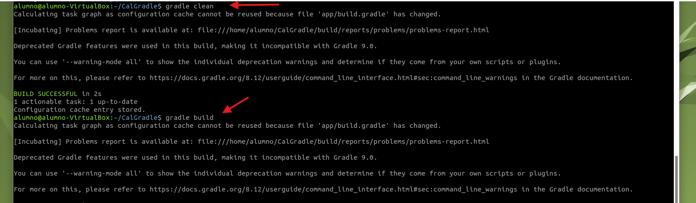
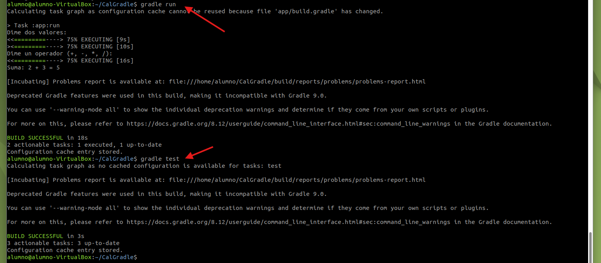

# Práctica: Calculadora en Gradle

## Configuración inicial

### Crear la estructura del proyecto

* Crea una carpeta para el proyecto y usa el comando `gradle init` para inicializarlo:

``` bash
gradle init
```



* La estructura inicial de Gradle tendrá este aspecto:

``` bash
tree
```



### Organizar el proyecto

* Crea carpetas personalizadas para organizar los archivos Java:

``` bash
mkdir -p app/src/main/java/com/roly/edd/calcgradle
mkdir -p app/src/test/java/com/roly/edd/calcgradle
```



* Mueve los archivos generados por Gradle a las nuevas carpetas:

``` bash
mv app/src/main/java/org/example/App.java app/src/main/java/com/roly/edd/calcgradle/
mv app/src/test/java/org/example/AppTest.java app/src/test/java/com/roly/edd/calcgradle/
```

* Elimina las carpetas sobrantes:

``` bash
rm -r app/src/main/java/org
rm -r app/src/test/java/org
```



### Añadir archivos personalizados

* Agrega tus archivos Java a la carpeta `calcgradle`:
  * `Calculadora.java`: Implementa las operaciones básicas.
  * `EjecutarCal.java`: Contiene el punto de entrada (`main`).

### Ajustar configuraciones en `build.gradle`

* Modifica la configuración para incluir la clase principal:

``` gradle
application {
    mainClass = 'com.roly.edd.calcgradle.EjecutarCal'
}
```

* Asegúrate de que el `package` de cada archivo Java sea correcto:

``` java
package com.roly.edd.calcgradle
```



## Agregar pruebas

### Archivo de pruebas

* Crea un archivo de prueba dentro de `app/src/test/java/com/roly/edd/calcgradle`, por ejemplo, `AppTest.java`, para validar las funcionalidades.

### Configurar pruebas en `build.gradle`

* Asegúrate de que las dependencias para pruebas estén definidas:

``` gradle
dependencies {
    testImplementation 'org.junit.jupiter:junit-jupiter-api'
    testRuntimeOnly 'org.junit.platform:junit-platform-launcher'
}
```

* Configura el uso de JUnit:

``` gradle
tasks.named('test') {
    useJUnitPlatform()
}
```



## Sin pruebas

### Si no se usan pruebas

* Elimina los archivos de prueba o las rutas correspondientes de `dependencies`:

``` gradle
dependencies {
    // testImplementation 'org.junit.jupiter:junit-jupiter-api'
    // testRuntimeOnly 'org.junit.platform:junit-platform-launcher'
}
```

* Desactiva las pruebas en `build.gradle`:

``` gradle
tasks.named('test') {
    enabled = false
}
```



### Habilitar entrada por terminal

* Gradle no permite entradas por terminal de forma predeterminada. Agrega esta línea en el fichero `build.gradle`:

``` gradle
tasks.named('run') {
    standardInput = System.in
}
```

## Ejecutar el proyecto

### Preparar, construir y ejecutar

* Ejecuta los siguientes comandos en orden:

``` bash
gradle clean
gradle build
```



``` bash
gradle run
gradle test
```


