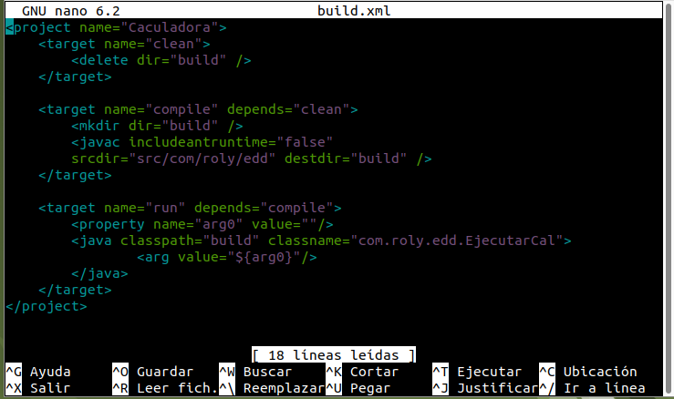
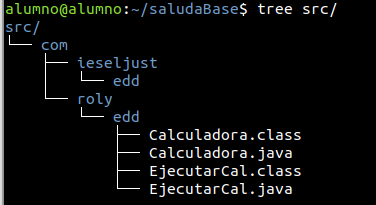
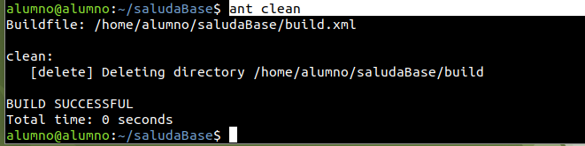
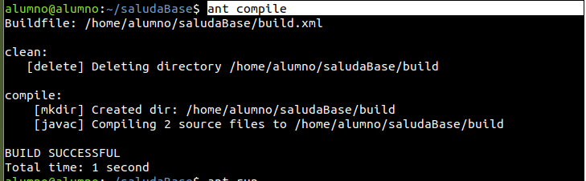
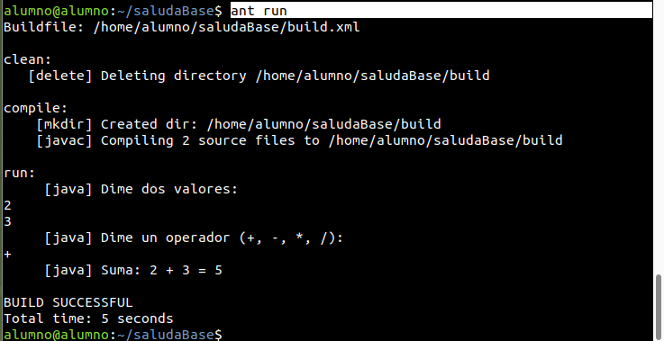

# **Ant. Crea el projecte ant amb els fonts de la calculadora i el build.xml correctament, amb els targets clean, compile i run.**

1. Crear el archivo build.xml

El fichero `build.xml` permitirá automatizar las siguientes tareas:

* **clean**: elimina los archivos generados anteriormente.
* **compile**: compila los archivos `.java` y genera los `.class`.
* **run**: ejecuta el programa principal `EjecutarCal`.

Código del archivo `build.xml`:

``` xml
<project name="Caculadora">
    <target name="clean">
        <delete dir="build" />
    </target>

    <target name="compile" depends="clean">
        <mkdir dir="build" />
        <javac includeantruntime="false" 
        srcdir="src/com/roly/edd" destdir="build" />
    </target>

    <target name="run" depends="compile">
        <property name="arg0" value=""/>
        <java classpath="build" classname="com.roly.edd.EjecutarCal">
                <arg value="${arg0}"/>
        </java>
    </target>
</project>
```



2. Crear la estructura de carpetas

Organizamos según las prácticas anteriores



3. Ejecutamos los comandos ant

**ant clean**

Elimina los archivos generados previamente.



**ant compile**

Compila el proyecto y genera los archivos `.class` en la carpeta `build`.



**ant run**

Inicia el programa y solicita los valores y el operador.


