# **Maven**
## **Maven Act 1. Configura el projecte correctament des de la línia d'ordres, partint del l'arquetip quickstart.**

1. Crear un nuevo proyecto Maven usando el arquetipo quickstart

Ejecuta el siguiente comando para crear un nuevo proyecto Maven con el arquetipo `quickstart`:

``` bash
mvn archetype:generate -DgroupId=com.roly.edd -DartifactId=calculadora -DarchetypeArtifactId=maven-archetype-quickstart -DinteractiveMode=false
```
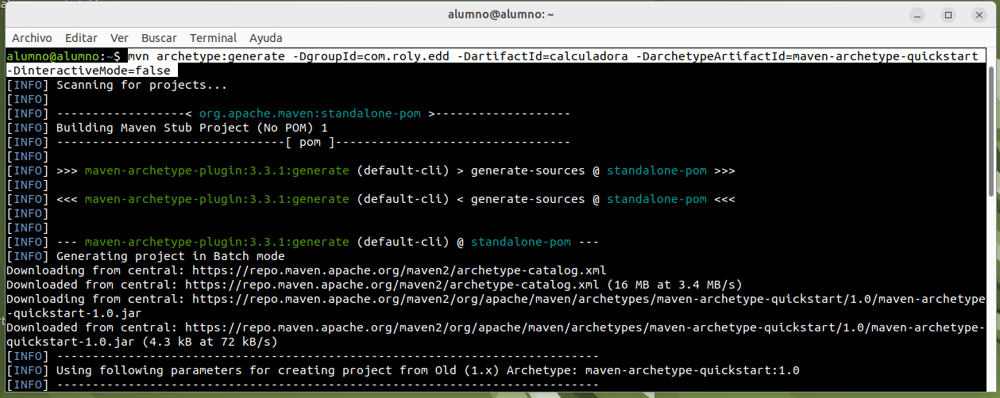

Este comando generará la estructura básica de un proyecto Maven en la carpeta calculadora, con una estructura predeterminada de directorios y archivos.

2. Estructura generada por Maven

Después de ejecutar el comando, Maven generará una estructura de directorios como esta:

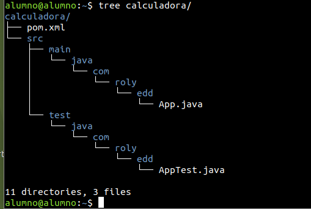

3. Implementar las clases de la Calculadora

Copiamos los archivos `Calculadora` y `EjecutarCal` en la carpeta main de los archivos que se ha generado Maven.

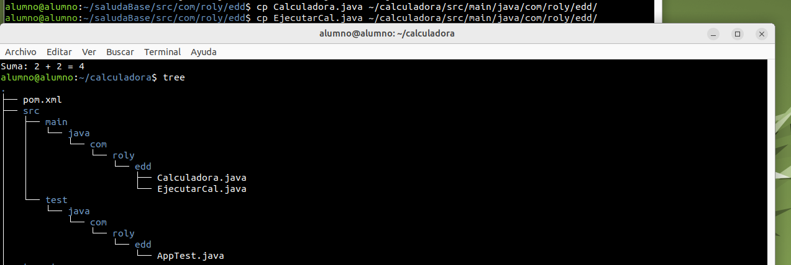

4. Configurar el archivo pom.xml
Abrimos y editamos el archivo `pom.xml` para configurar las dependencias y los plugins necesarios.

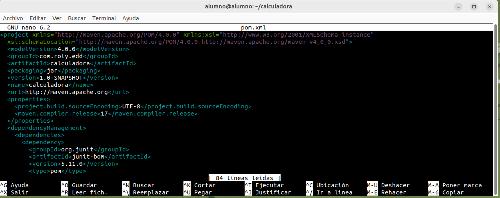

5. Ejecutar los comandos Maven

Compilar el proyecto:
Una vez configurado el archivo `pom.xml` y añadidas las clases necesarias, ejecutamos el siguiente comando para compilar el proyecto:
`mvn clean compile`

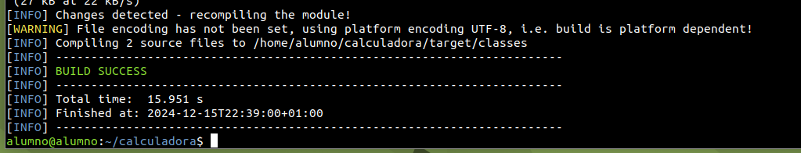

Este comando compilará el código y generará la estructura necesaria en la carpeta target.

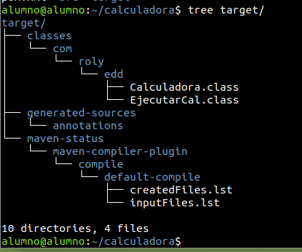

6. Ejecutar el programa
Para ejecutar el programa después de compilarlo, podemos hacerlo directamente con el siguiente comando:

`java -cp target/classes com.roly.edd.EjecutarCal`

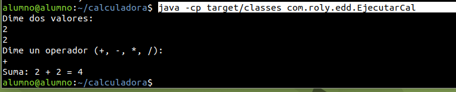

Este comando ejecuta la clase principal `EjecutarCal` que contiene el método `main()`, utilizando la carpeta `target/classes` como el `classpath`.


## **Maven Act 2. Genera el projecte correctament des de VSCde.**

1. Buscamos la ventana en VSC donde aparezca "MAVEN" y daremos click al simbolo "+" para crear un proyecto Maven nuevo:

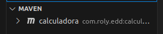

2. En la paleta de órdenes nos aparecerán los diferentes arquetipos de los que disponemos. Busque quickstart, y seleccione `maven-Archetype-quickstart`.

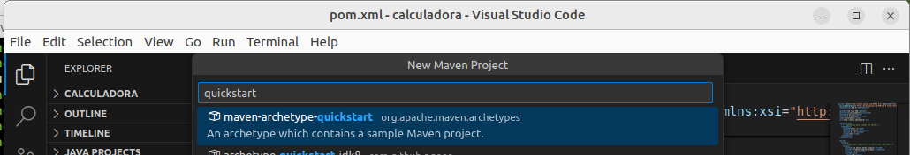

3. Indique la versión (1.0), el groupId (com.roly.edd), y el nom (calculadoravsc) del proyecto.

4. Además, si usas el terminal integrado de VSCode, nos mostrará la versión propietaria que falta por configurar. Dejamos el valor predeterminado `1.0-SNAPSHOT`, y pulsamos Intro para crear el proyecto:

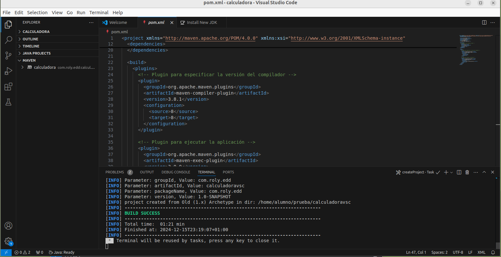

5. Una vez generado el proyecto, si echamos un vistazo a la estructura de carpetas generada y al pom.xml , veremos que es prácticamente igual a la que definimos en la consola.

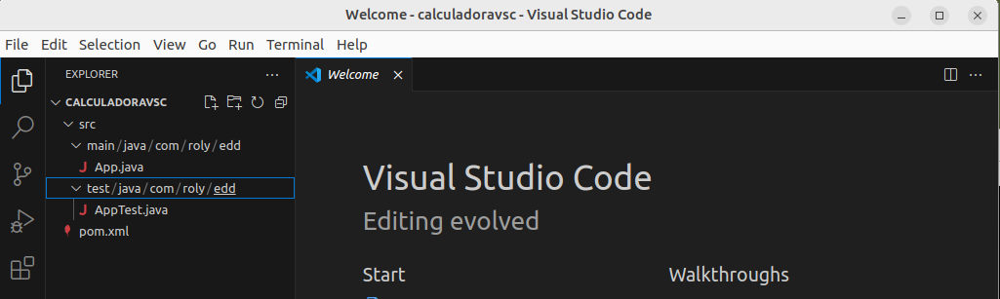
