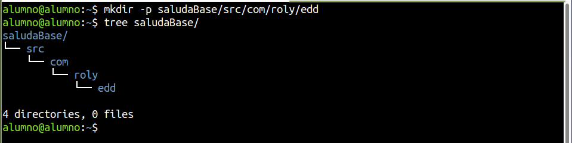
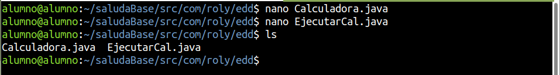
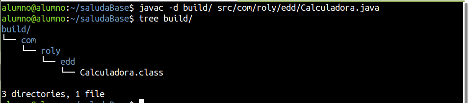
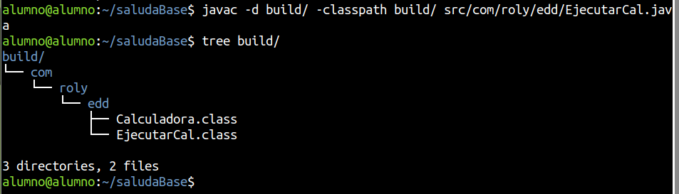
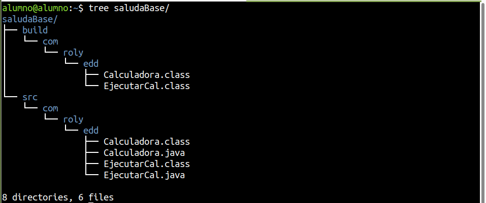

# **Activitat - Herramientas de automatización**

Crea una classe anomenada Calculadora en un paquet format pel teu nom (per exemple com.jose.edd) amb els següents mètodes (funcions):

* public static int suma(int a, int b): Que suma a i b i retorna el resultat,
* public static int resta(int a, int b): Que resta a i b i retorna el resultat,
* public static int multiplica(int a, int b): Que multiplica a i b i retorna el resultat,
* public static int divideix(int a, int b): Que divideix a entre b i retorna el resultat. Si b és 0, mostra l'error i torna un 0.

I una altra classe que a la funció principal faça ús d'aquestes funcions, i mostre els resultats per pantalla.

Crea el directori build, i fes ús d'aquest com a classpath.

Indica a un fitxer Markdown el procés que has seguit, incloent el codi font, les ordres per compilar i per executar, i l'estructura de carpetes resultant. Fes una breu explicació de cada cosa.

-----

## **Herramientas de automatización - java, javac**

### **Crear fichero y comprobar la estructura de carpetas**

``mkdir -p saludaBase/src/com/roly/edd``

``tree saludaBase/``



### **Archivos java**

Creamos dos ficheros, uno el programa y otro aquel que maneja la interacción con el usuario y utiliza la lógica definida por el otro fichero java.



Archivos javas:
* Calculadora.java 
    * Contiene métodos estáticos para realizar las operaciones matemáticas (sumar, restar, multiplicar, dividir).
    * Proporciona métodos reutilizables que realizan cálculos.
    * Código:

    ```
    package com.roly.edd;

    public class Calculadora {
        public static int sumar(int a, int b) {
            return a + b;
        }

        public static int restar(int a, int b) {
            return a - b;
        }

        public static int multiplicar(int a, int b) {
            return a * b;
        }

        public static double dividir(int a, int b) {
            if (b == 0) throw new ArithmeticException("No se puede dividir por 0");
            return (double) a / b;
        }
    }
    ```

* EjecutarCal.java:
    * Gestiona la interacción con el usuario: solicita datos, recibe el operador, y utiliza los métodos de “Calculadora” para realizar cálculos, mostrando los resultados.
    * Código:

    ```
    package com.roly.edd;

    import java.util.InputMismatchException;
    import java.util.Scanner;

    public class EjecutarCal {
        static Scanner teclat = new Scanner(System.in);

        public static void main(String[] args) {
            try {
                System.out.println("Dime dos valores: ");
                int a = teclat.nextInt();
                int b = teclat.nextInt();
                teclat.nextLine();

                System.out.println("Dime un operador (+, -, *, /): ");
                char operador = teclat.nextLine().charAt(0);

                switch (operador) {
                    case '+':
                        System.out.println("Suma: " + a + " + " + b + " = " + Calculadora.sumar(a, b));
                        break;
                    case '-':
                        System.out.println("Resta: " + a + " - " + b + " = " + Calculadora.restar(a, b));
                        break;
                    case '*':
                        System.out.println("Multiplicación: " + a + " * " + b + " = " + Calculadora.multiplicar(a, b));
                        break;
                    case '/':
                        System.out.println("División: " + a + " / " + b + " = " + Calculadora.dividir(a, b));
                        break;
                    default:
                        System.out.println("Operador no válido");
                }
            } catch (InputMismatchException e) {
                System.out.println("Error en la entrada de datos");
            } catch (ArithmeticException e) {
                System.out.println(e.getMessage());
            }
        }
    }
    ```
### **Compilar java**
Ejecutaremos javac para compilar el código fuente Java y generar los archivos `.class`, que contiene el bytecode, la cual es el formato para que la máquina (JVM) pueda entender y ejecutar.  
Nos situaremos en un directorio más arriba, como en `saludaBase/src`.

`javac com/roly/edd/Calculadora.java`  
`javac com/roly/edd/EjecutarCal.java`  
`tree”`


### **Ejecución del programa**
* La JVM carga el archivo ``EjecutarCal.class`` desde la estructura de paquetes ``com.roly.edd.xxx``
* Interpreta el bytecode y comienza la ejecución desde el método ``main`` del archivo ``EjecutarCal.java``


* El programa interactúa con el usuario según lo definido en el código fuente.

Ejemplo de ejecución del código.
``java com.roly.edd.Ejecutar.Cal``


## **Classpath y destino de la compilación**
### **Crear directorio “build”**
Crearemos la carpeta “build” y comprobaremos la estructura del directorio.


### **Compilación dirigida con estructura**

``javac -d build/ src/com/roly/edd/Calculadora.java``

El comando compila el código fuente ubicado en “src/com/roly/edd/Calculadora.java” y genera el archivo “.class” (bytecode) en una carpeta específica (build/). Esto hace que la estructura del paquete (com/alumno/edd) se replique automáticamente dentro de la carpeta build.

* La opción -d especifica el directorio de salida donde se colocarán los archivos compilados .class

Ejecución del comando y comprobar la estructura



### **Compilación con dependencias**

``javac -d build -classpath build src/com/roly/edd/EjecutarCal.java”``

El comando compila el archivo ``EjecutarCal.java`` desde la carpeta ``src/com/roly/edd/`` y coloca su archivo ``.class`` en la carpeta build.

* La opción ``-classpath build`` le indica al compilador dónde buscar las clases ya compiladas (como ``Calculadora.class``), necesarias para que el programa funcione.



### **Estructura completa**
``tree saludaBase/``



### **Ejecutar código**
``java -cp build/ com.roly.edd.EjecutarCal``

Ejecutamos el programa Java especificando en la clase ``EjecutarCal``, situada en el paquete ``com.roly.edd``.

* ``-cp (o --class-path)`` indica el directorio donde la JVM debe buscar las clases compiladas. En este caso, build/ es el directorio donde se encuentran los archivos .class generados por javac.

